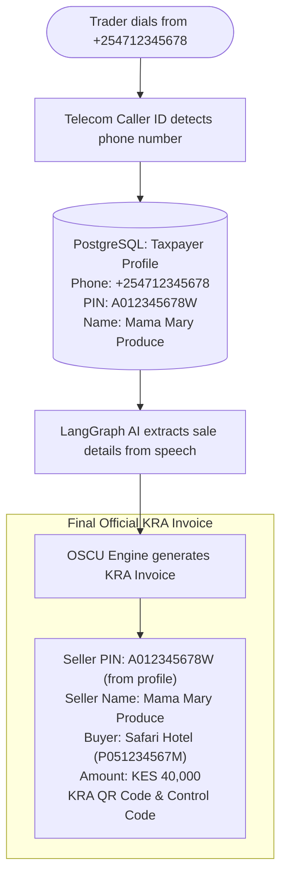

# JibuTax (Voice-First eTIMS Orchestrator)

> **Voice-First eTIMS Orchestrator for Kenya KRA Compliance**  
> Empowering informal traders and micro-enterprises to file official KRA electronic tax invoices through natural voice conversations in Swahili, English, and Sheng.

---

## 🚀 Tech Stack

- **Backend:** FastAPI (Python 3.10+)
- **Database:** PostgreSQL (with SQLAlchemy ORM)
- **Frontend:** React (JavaScript), Tailwind CSS, Vite
- **Voice AI:** ElevenLabs Conversational Agent (Webhooks & Tool Integration)
- **Deployment:** Render (`render.yaml`) & Docker Compose

---

## 🌿 Team Collaboration & Git Workflow

> **IMPORTANT:** Never commit or push directly to `main`.  
> All work must be conducted on feature branches (e.g. `feat/role4-agent-routing`) and submitted via a Pull Request (PR) for review. See [CONTRIBUTING.md](CONTRIBUTING.md) for details.

---

## 📂 Project Template & File Structure

```
jibu-tax/
├── backend/
│   ├── app/
│   │   ├── __init__.py               # Backend package initialization
│   │   ├── main.py                   # FastAPI app entry point, CORS, router mounts
│   │   ├── config.py                 # Pydantic Settings & environment variables
│   │   ├── database.py               # PostgreSQL engine & session generator (get_db)
│   │   ├── models/                   # SQLAlchemy ORM database models
│   │   │   ├── __init__.py           # Models package initialization
│   │   │   ├── taxpayer.py           # KRA Taxpayer PIN registry model
│   │   │   ├── invoice.py            # eTIMS fiscal electronic invoices & items model
│   │   │   └── call_session.py       # Voice interaction & call audit logs model
│   │   ├── schemas/                  # Pydantic data schemas
│   │   │   ├── __init__.py           # Schemas package initialization
│   │   │   ├── kra.py                # KRA PIN validation request/response schemas
│   │   │   ├── tax.py                # Deterministic tax calculation schemas
│   │   │   ├── etims.py              # eTIMS OSCU invoice generation schemas
│   │   │   └── webhook.py            # ElevenLabs tool & post-call webhook schemas
│   │   ├── services/                 # Zero-trust business logic layer
│   │   │   ├── __init__.py           # Services package initialization
│   │   │   ├── kra_service.py        # PIN validation & taxpayer lookup (eCitizen gateway)
│   │   │   ├── tax_engine.py         # Non-AI deterministic VAT engine (16%, exempt, zero)
│   │   │   ├── oscu_engine.py        # eTIMS OSCU signing, control codes & KRA QR data
│   │   │   └── sms_dispatcher.py     # Post-call SMS receipt delivery (Africa's Talking)
│   │   └── api/                      # REST API endpoints
│   │       ├── __init__.py           # API package initialization
│   │       └── v1/                   # Version 1 API routes
│   │           ├── __init__.py       # V1 package initialization
│   │           ├── api.py            # V1 Router aggregator
│   │           ├── kra.py            # KRA PIN verification endpoints
│   │           ├── invoices.py       # eTIMS invoice management endpoints
│   │           ├── webhooks.py       # ElevenLabs conversational voice agent tools
│   │           └── stats.py          # Dashboard analytics & compliance metrics
│   ├── tests/                        # Automated unit tests
│   │   ├── __init__.py               # Tests package initialization
│   │   ├── test_kra_service.py       # KRA PIN validation tests
│   │   └── test_tax_engine.py        # Deterministic tax engine tests
│   ├── requirements.txt              # Python package dependencies
│   └── Dockerfile                    # Backend production container specification
│
├── frontend/
│   ├── public/                       # Static public assets
│   ├── src/
│   │   ├── components/               # React UI components
│   │   │   ├── Header.jsx            # Top navigation & compliance status indicator
│   │   │   ├── VoiceSimulator.jsx    # Interactive Swahili/English voice agent tester
│   │   │   ├── InvoiceViewer.jsx     # Official KRA eTIMS receipt visualizer with QR
│   │   │   ├── TaxCalculator.jsx     # Deterministic tax calculation playground
│   │   │   ├── PinChecker.jsx        # KRA PIN verification tool
│   │   │   └── InvoiceList.jsx       # Historical electronic invoice audit log
│   │   ├── services/
│   │   │   └── api.js                # Frontend API client for FastAPI backend
│   │   ├── App.jsx                   # Root application layout
│   │   ├── index.css                 # Tailwind CSS directives & custom styles
│   │   └── main.jsx                  # React DOM mount point
│   ├── index.html                    # HTML entry point
│   ├── package.json                  # React & Tailwind dependencies
│   ├── vite.config.js                # Vite bundler & backend proxy config
│   ├── tailwind.config.js            # Tailwind CSS configuration
│   └── postcss.config.js             # PostCSS plugins configuration
│
├── elevenlabs/
│   ├── agent_config.json             # ElevenLabs Conversational AI Agent config & tools
│   └── system_prompt.md              # Swahili/English "Msaidizi wa eTIMS" persona prompt
│
├── docker-compose.yml                # Multi-container orchestration (Postgres, Backend, Frontend)
├── render.yaml                       # 1-Click Render deployment blueprint
├── .env.example                      # Environment variables template
├── .gitignore                        # Git exclusion rules
└── README.md                         # Project documentation
```

---

## 🏛️ Regulatory Context & System Workflow

Following Kenya's **Finance Act 2023**, eTIMS compliance became mandatory for business expense deductibility. JibuTax addresses informal trader friction through:

1. **Voice Ingestion & Intent Parsing:** Trader speaks to an ElevenLabs voice agent in Swahili, English, or Sheng.
2. **Real-Time Webhook Verification:** ElevenLabs calls the backend webhook to validate the buyer's KRA PIN.
3. **Zero-Trust Backend:** The backend queries the KRA PIN registry securely without exposing government endpoints directly to the LLM.
4. **Deterministic Calculation:** A pure non-AI Python engine computes the VAT liability (16%, exempt, or zero-rated).
5. **eTIMS OSCU Filing:** The transaction is signed with an OSCU cryptographic control code and a verifiable KRA QR code.
6. **Post-Call Finalization:** An SMS receipt containing the KRA QR verification link is dispatched to the trader's phone.

---

## 📱 Identity & PIN Architecture: How Informal Traders Use JibuTax

A major friction point for informal traders (*mama mboga*, smallholder farmers, boda boda riders) is that memorizing and reciting an 11-digit alphanumeric KRA PIN over a cellular call is error-prone and frustrating.

### 1. Does the Final eTIMS Invoice Have the Trader's KRA PIN?
**YES.** Under Kenya tax law, an eTIMS electronic tax invoice is legally invalid without the **Seller's KRA PIN**. The KRA OSCU engine will reject any submission missing a seller PIN.

### 2. How JibuTax Solves This: Phone-to-PIN Profile Mapping
Traders **do NOT have to recite their KRA PIN on routine calls**:



1. **One-Time Onboarding:** The first time a trader dials JibuTax, they provide their National ID or KRA PIN once. In Kenya, mobile phone lines are already legally bound to National IDs under CAK SIM regulations and KRA iTax profiles.
2. **Routine Daily Calls (Zero Friction):** On subsequent calls, JibuTax recognizes their caller phone number (`caller_phone`), pulls their pre-saved KRA PIN (`A012345678W`), and automatically stamps it on the official invoice.

---

### 3. What About the Buyer PIN? (B2B vs. Retail B2C Sales)

Under KRA eTIMS regulations, the requirement for a buyer PIN depends on the buyer type:

* **Corporate / Business Buyers (B2B): Mandatory.**  
  When selling to a corporate client (*Safari Hotel*, *Naivas*, a school), the buyer gives the trader their corporate PIN so the company can claim business tax deductions. The trader simply speaks the PIN: *"PIN yao ni P051234567M"*.
* **Retail Consumers (B2C): Completely Optional.**  
  When selling to everyday walk-in citizens buying groceries or farm produce, **no buyer PIN is required**. The trader simply says *"Nimeuza viazi magunia kumi kwa shilingi elfu mbili"*, and JibuTax automatically logs it as a valid Retail Consumer sale without blocking or asking for a PIN.

