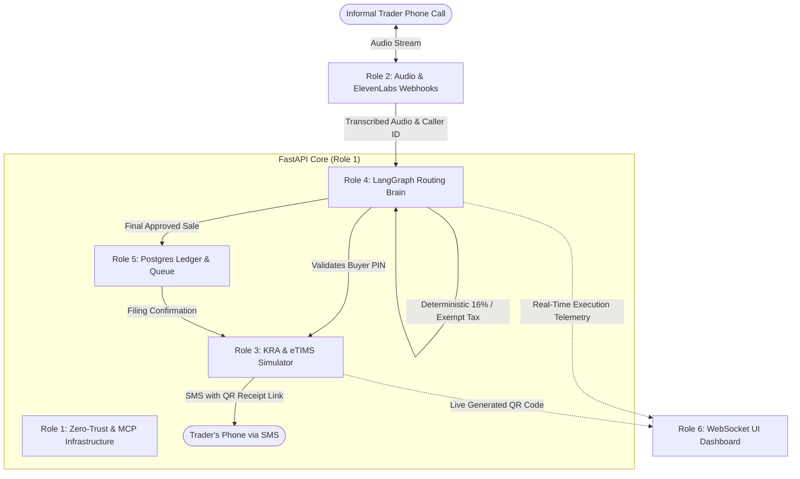

# JibuTax: 6-Person Engineering Team Roles & Architecture Matrix

> **48-Hour All-Coder Hackathon Execution Plan**  
> To build, integrate, and win within 48 hours without blocking one another, each engineer owns a distinct micro-architecture and adheres to agreed JSON contracts.

---

## 🧭 Team Architecture Matrix

---

## 👤 Role 1: Zero-Trust & MCP Infrastructure Engineer

**The Mission:** Build the secure FastAPI shell, Model Context Protocol (MCP) server, and runtime credential isolation vault. You are the "brakes" that keep the AI from hallucinating or executing unauthorized actions.

### Key Deliverables:
1. **Production FastAPI Core:** Server entry point, CORS middleware, health probes, and deployment configuration (`render.yaml`).
2. **MCP Interception Layer:** Expose Pydantic tool schemas to the agent, with runtime parameter-stripping middleware to inspect every tool call before execution.
3. **Credential Isolation:** Ensure government API keys and webhook secrets are injected strictly at runtime inside isolated functions — never exposed to the LLM prompt context.

### File Ownership:
- [`backend/app/main.py`](file:///c:/Users/Nesh/Desktop/Cursor%20Hack/backend/app/main.py)
- [`backend/app/config.py`](file:///c:/Users/Nesh/Desktop/Cursor%20Hack/backend/app/config.py)
- [`backend/app/database.py`](file:///c:/Users/Nesh/Desktop/Cursor%20Hack/backend/app/database.py)
- [`render.yaml`](file:///c:/Users/Nesh/Desktop/Cursor%20Hack/render.yaml)
- [`docker-compose.yml`](file:///c:/Users/Nesh/Desktop/Cursor%20Hack/docker-compose.yml)

---

## 👤 Role 2: Conversational State & Audio Orchestrator

**The Mission:** Tame the unstructured latency and conversational nuances of human speech over telephone channels using ElevenLabs Conversational AI.

### Key Deliverables:
1. **Bilingual Persona Tuning:** Swahili, English, and Sheng code-switching system prompts ("Msaidizi wa JibuTax").
2. **Conversational Latency Fillers:** Dynamic webhook injection of verbal bridges (*"Subiri kidogo ninakagua KRA..."*) while awaiting backend validation.
3. **Post-Call Finalization:** Webhook triggered when the trader hangs up, finalizing database records and firing SMS receipts.

### File Ownership:
- [`elevenlabs/agent_config.json`](file:///c:/Users/Nesh/Desktop/Cursor%20Hack/elevenlabs/agent_config.json)
- [`elevenlabs/system_prompt.md`](file:///c:/Users/Nesh/Desktop/Cursor%20Hack/elevenlabs/system_prompt.md)
- [`backend/app/api/v1/webhooks.py`](file:///c:/Users/Nesh/Desktop/Cursor%20Hack/backend/app/api/v1/webhooks.py)

---

## 👤 Role 3: Cryptographic eTIMS Simulator & API Integrator

**The Mission:** Build the bridge to Kenya government infrastructure (eCitizen / iTax) and construct a mathematically rigorous OSCU simulator.

### Key Deliverables:
1. **Live KRA PIN Checker:** HTTP client querying eCitizen developer portal (`PIN Checker by PIN` API) under 500ms SLA.
2. **eTIMS OSCU Engine:** Cryptographic SHA-256 fiscal control codes, KRA URL payload structure, and dynamic QR code image generation.
3. **SMS Gateway:** Africa's Talking / Twilio integration dispatching official KRA receipt links to the trader's phone.

### File Ownership:
- [`backend/app/services/kra_service.py`](file:///c:/Users/Nesh/Desktop/Cursor%20Hack/backend/app/services/kra_service.py)
- [`backend/app/services/oscu_engine.py`](file:///c:/Users/Nesh/Desktop/Cursor%20Hack/backend/app/services/oscu_engine.py)
- [`backend/app/services/sms_dispatcher.py`](file:///c:/Users/Nesh/Desktop/Cursor%20Hack/backend/app/services/sms_dispatcher.py)
- [`backend/app/api/v1/kra.py`](file:///c:/Users/Nesh/Desktop/Cursor%20Hack/backend/app/api/v1/kra.py)
- [`backend/app/api/v1/invoices.py`](file:///c:/Users/Nesh/Desktop/Cursor%20Hack/backend/app/api/v1/invoices.py)

---

## 👤 Role 4: Multi-Agent Routing Logic (LangGraph Engineer)

**The Mission:** Build the central "brain" using Google Gemini (Gemini 2.5 Flash) and LangGraph, routing data deterministically without arithmetic hallucinations.

### Key Deliverables:
1. **Rigid State Contract:** `JibuTaxState` TypedDict + Pydantic validation models.
2. **Node 1 (Entity Extraction):** Gemini 2.5 Flash structured output parsing commodity, quantity, unit price, and buyer PIN.
3. **Node 2 (KRA Validation & Branching):** Alphanumeric regex format checks, entity resolution, and clarification reprompt routing.
4. **Node 3 (Deterministic Tax Math):** Pure Python rule engine applying First Schedule VAT exemptions (produce) vs 16% standard VAT.
5. **MemorySaver Checkpointing:** Preserves conversation state using `caller_phone` as `thread_id` to survive mid-call audio drops.

### File Ownership:
- [`backend/app/agent/state.py`](file:///c:/Users/Nesh/Desktop/Cursor%20Hack/backend/app/agent/state.py)
- [`backend/app/agent/prompts.py`](file:///c:/Users/Nesh/Desktop/Cursor%20Hack/backend/app/agent/prompts.py)
- [`backend/app/agent/graph.py`](file:///c:/Users/Nesh/Desktop/Cursor%20Hack/backend/app/agent/graph.py)
- [`backend/app/agent/nodes/`](file:///c:/Users/Nesh/Desktop/Cursor%20Hack/backend/app/agent/nodes/)
- [`backend/app/api/v1/agent.py`](file:///c:/Users/Nesh/Desktop/Cursor%20Hack/backend/app/api/v1/agent.py)
- [`backend/tests/test_agent_robust.py`](file:///c:/Users/Nesh/Desktop/Cursor%20Hack/backend/tests/test_agent_robust.py)

---

## 👤 Role 5: Asynchronous Ledger & Tax Filing Engine

**The Mission:** Transform single-receipt issuance into a scalable, automated compliance ledger for long-term tax filing.

### Key Deliverables:
1. **PostgreSQL Ledger:** Relational schema capturing traders, verified invoices, line items, and audit trails.
2. **Async Task Queue:** Background worker queue (Celery / Redis / BackgroundTasks) ensuring DB operations never introduce latency to voice calls.
3. **Automated Return Cron Jobs:** End-of-month scripts:
   - On the 18th, evaluates monthly sales and targets `TOT Return Filing` (Turnover Tax).
   - If sales are zero, automatically files `NIL Return` to protect the trader from penalties.

### File Ownership:
- [`backend/app/models/taxpayer.py`](file:///c:/Users/Nesh/Desktop/Cursor%20Hack/backend/app/models/taxpayer.py)
- [`backend/app/models/invoice.py`](file:///c:/Users/Nesh/Desktop/Cursor%20Hack/backend/app/models/invoice.py)
- [`backend/app/models/call_session.py`](file:///c:/Users/Nesh/Desktop/Cursor%20Hack/backend/app/models/call_session.py)
- [`backend/app/api/v1/stats.py`](file:///c:/Users/Nesh/Desktop/Cursor%20Hack/backend/app/api/v1/stats.py)

---

## 👤 Role 6: WebSocket Telemetry Dashboard (Frontend)

**The Mission:** Build the "demo magic" for the judges. Visualize the deep backend orchestrations in real-time as speech happens.

### Key Deliverables:
1. **Modern Dark-Mode Dashboard:** Built with React, JavaScript, and Tailwind CSS.
2. **Real-Time Telemetry Client:** WebSocket / SSE connection lighting up LangGraph nodes on screen as the presenter speaks into the phone.
3. **Instant QR Receipt Render:** Display official KRA receipt and scannable QR code the exact millisecond the SMS hits the phone.

### File Ownership:
- [`frontend/src/App.jsx`](file:///c:/Users/Nesh/Desktop/Cursor%20Hack/frontend/src/App.jsx)
- [`frontend/src/components/Header.jsx`](file:///c:/Users/Nesh/Desktop/Cursor%20Hack/frontend/src/components/Header.jsx)
- [`frontend/src/components/VoiceSimulator.jsx`](file:///c:/Users/Nesh/Desktop/Cursor%20Hack/frontend/src/components/VoiceSimulator.jsx)
- [`frontend/src/components/InvoiceViewer.jsx`](file:///c:/Users/Nesh/Desktop/Cursor%20Hack/frontend/src/components/InvoiceViewer.jsx)
- [`frontend/src/components/TaxCalculator.jsx`](file:///c:/Users/Nesh/Desktop/Cursor%20Hack/frontend/src/components/TaxCalculator.jsx)
- [`frontend/src/components/PinChecker.jsx`](file:///c:/Users/Nesh/Desktop/Cursor%20Hack/frontend/src/components/PinChecker.jsx)
- [`frontend/src/components/InvoiceList.jsx`](file:///c:/Users/Nesh/Desktop/Cursor%20Hack/frontend/src/components/InvoiceList.jsx)

---

## 🌿 Git Collaboration Rules

1. **NEVER push or merge directly into `main`.**
2. **Branch Naming:**
   - Role 1: `feat/role1-mcp-infra`
   - Role 2: `feat/role2-audio-orchestrator`
   - Role 3: `feat/role3-etims-simulator`
   - Role 4: `feat/role4-agent-routing`
   - Role 5: `feat/role5-ledger-filing`
   - Role 6: `feat/role6-telemetry-dashboard`
3. **Submit all work via GitHub Pull Request (PR)** with verification notes.
